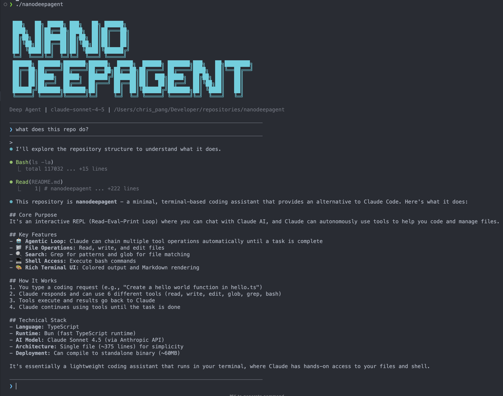

# nanocode



> **Credit**: This project was inspired by [nanocode](https://github.com/1rgs/nanocode) - thanks for the original idea!
>
> **Want more?** If you're looking to build a more comprehensive version with a proper deep agent harness, check out [Deep Agent SDK](https://deepagentsdk.dev/docs).

A minimal Claude Code alternative - an interactive terminal-based coding assistant with agentic tool use. Built with TypeScript and Bun, nanocode provides a streaming REPL interface where Claude can read, edit, search files, and execute shell commands autonomously.

## Features

- **Agentic Loop**: Claude continuously executes tools until tasks complete
- **Streaming**: Real-time text output via Server-Sent Events
- **Parallel Tool Execution**: Multiple tool calls run concurrently when the model decides they're independent
- **File Operations**: Read, write, and edit files with line numbers
- **Code Search**: Grep patterns and glob file matching
- **Shell Integration**: Execute bash commands directly
- **Bun Runtime**: Fast TypeScript execution and standalone binary compilation

## Quick Start

### Prerequisites

- [Bun](https://bun.sh) v1.3.4 or later
- Anthropic API key

### Installation

1. Clone the repository:

```bash
git clone https://github.com/mrcloudchase/nanocode.git
cd nanocode
```

2. Set up your API key:

```bash
echo "ANTHROPIC_API_KEY=your_key_here" > .env
```

### Running

#### Development mode (interpreted)

```bash
bun nanocode.ts
```

#### Compile to standalone binary

```bash
bun build nanocode.ts --compile --outfile nanocode
./nanocode
```

## Usage

Once running, you'll see the logo and a prompt. Type your coding request, and Claude will use tools autonomously to complete the task.

### REPL Commands

- `/q` or `exit` - Quit the application
- `/c` - Clear conversation history
- `Enter` (empty) - Skip to next prompt

### Example Session

```
> Create a hello world function in hello.ts

> Write(hello.ts)
  ok

> I've created a hello.ts file with a simple hello world function...
```

## Tool Capabilities

| Tool | Description | Parameters |
|------|-------------|------------|
| `read` | Read file with line numbers | `path`, `offset?`, `limit?` |
| `write` | Write content to file | `path`, `content` |
| `edit` | Replace text in file | `path`, `old`, `new`, `all?` |
| `glob` | Find files by pattern | `pat`, `path?` |
| `grep` | Search files with regex | `pat`, `path?` |
| `bash` | Execute shell commands | `cmd` |

## Architecture

### Single-File Design

The entire application is contained in `nanocode.ts`:

- Constants (API URL, model, ANSI colors)
- Tool implementations (six file/system tools)
- Streaming API layer (SSE parser, tool input accumulator)
- Main REPL (interactive agentic loop)

### Agentic Loop

1. User provides request
2. Claude responds via streaming (text prints in real-time)
3. If `stop_reason` is `tool_use`, tools execute in parallel via `Promise.all`
4. Tool results (success or error) are sent back to Claude
5. Loop continues until `stop_reason` is `end_turn`

### Tool Execution Model

The model decides which tools to call and whether they're independent. If multiple `tool_use` blocks appear in a single response, they run concurrently. If the model needs sequential execution, it calls tools across separate turns. No client-side ordering logic needed.

Tool errors propagate directly to the model with `is_error: true`, allowing it to adjust its approach on the next turn.

## Configuration

### Model

Default: `claude-sonnet-4-5`

Edit the `MODEL` constant in `nanocode.ts` to change.

### Environment Variables

- `ANTHROPIC_API_KEY` (required) - Your Anthropic API key

## Building for Different Platforms

```bash
# macOS ARM64 (default on Apple Silicon)
bun build nanocode.ts --compile --outfile nanocode

# x86_64 (Intel)
bun build nanocode.ts --compile --target=x86_64 --outfile nanocode-x64

# Linux ARM64
bun build nanocode.ts --compile --target=linux-arm64 --outfile nanocode-linux-arm64
```

## Limitations

- Single conversation thread (use `/c` to clear)
- No conversation persistence between sessions
- Grep results capped at 50 matches
- Shell commands timeout after 30 seconds

## License

MIT

## Acknowledgments

Inspired by Claude Code and built as a demonstration of agentic tool use with the Anthropic API.
